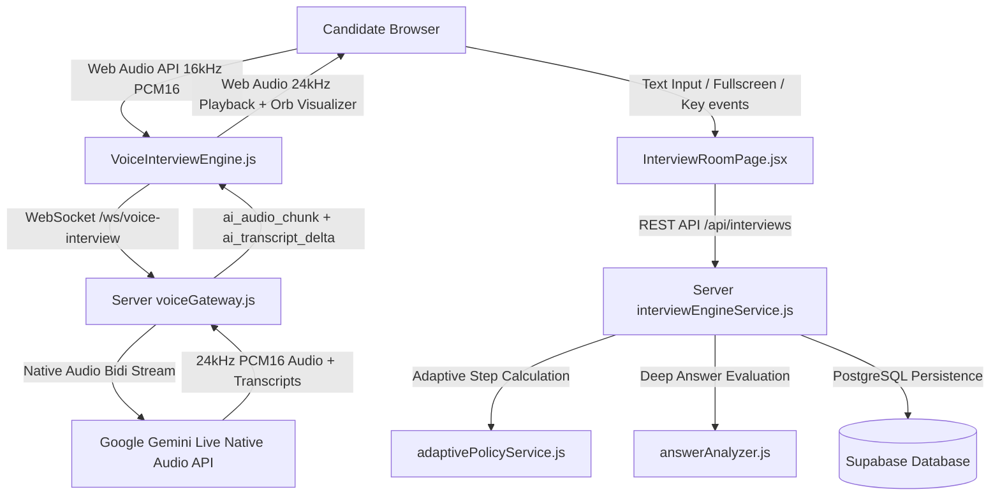
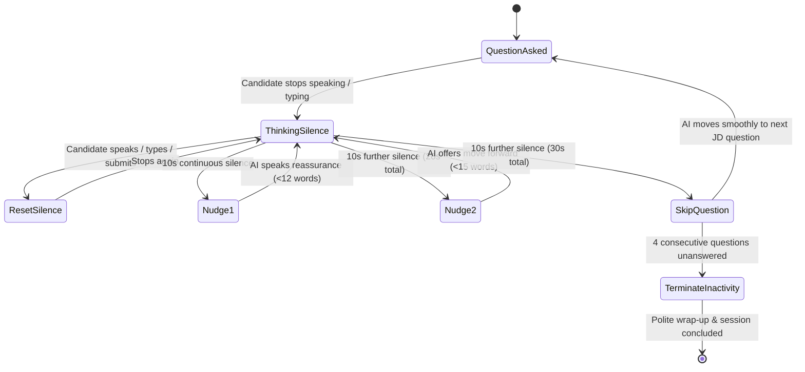
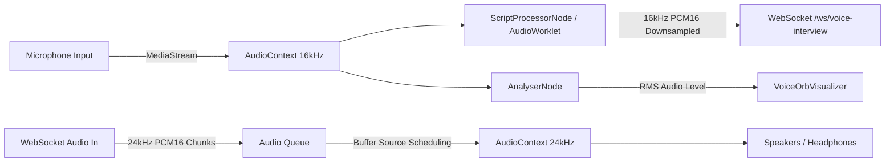
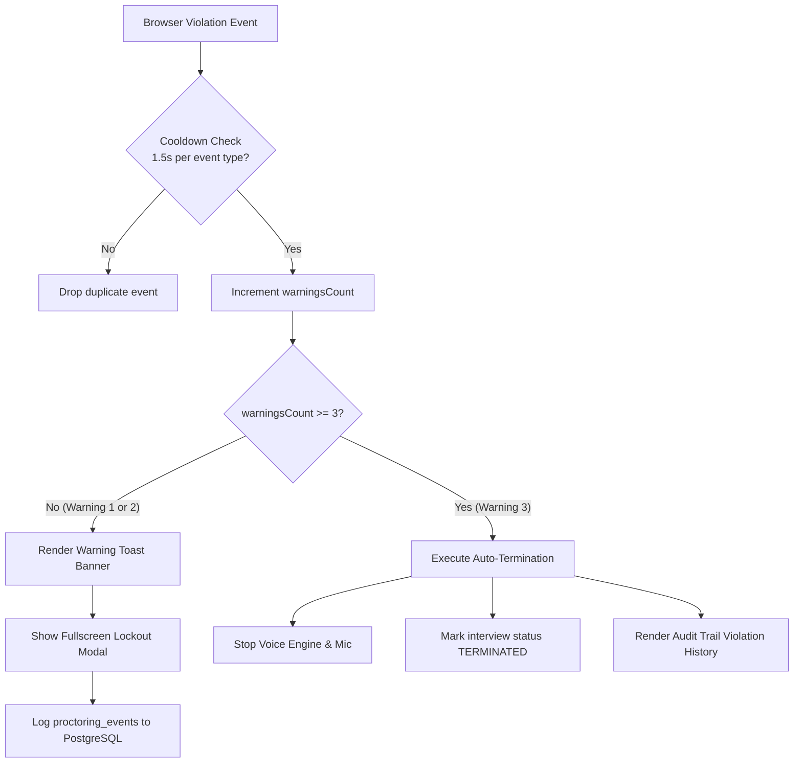

# QualifyAI Real-Time Voice & Text Meeting Room — Complete Implementation & Operational Specification

**File Identity & Location:** `MEETING_ROOM_IMPLEMENTATION_SPEC.md`  
**Companion Link:** `docs/interview/MEETING_ROOM_SPEC.md`  
**Governing Architecture:** Phase 5, Phase 6, Phase 7, Phase 9 of [phases.md](file:///d:/JAVA%20WEBDEV/QualifyAI/phases.md) & [architecture.md](file:///d:/JAVA%20WEBDEV/QualifyAI/architecture.md)  
**Primary Source Implementations:**
- Client Meeting Room: [`InterviewRoomPage.jsx`](file:///d:/JAVA%20WEBDEV/QualifyAI/client/src/pages/InterviewRoomPage.jsx)
- Client Audio Engine: [`voiceInterviewEngine.js`](file:///d:/JAVA%20WEBDEV/QualifyAI/client/src/services/voiceInterviewEngine.js)
- Client Visualizer Orb: [`VoiceOrbVisualizer.jsx`](file:///d:/JAVA%20WEBDEV/QualifyAI/client/src/components/interview/VoiceOrbVisualizer.jsx)
- Client Proctoring Tracker: [`proctoringService.js`](file:///d:/JAVA%20WEBDEV/QualifyAI/client/src/services/proctoringService.js)
- Server Voice Gateway: [`voiceGateway.js`](file:///d:/JAVA%20WEBDEV/QualifyAI/server/src/services/voice/voiceGateway.js)
- Server Interview Engine: [`interviewEngineService.js`](file:///d:/JAVA%20WEBDEV/QualifyAI/server/src/services/interview/interviewEngineService.js)
- Adaptive Policy Engine: [`adaptivePolicyService.js`](file:///d:/JAVA%20WEBDEV/QualifyAI/server/src/services/interview/adaptivePolicyService.js)
- Answer Analyzer: [`answerAnalyzer.js`](file:///d:/JAVA%20WEBDEV/QualifyAI/server/src/services/interview/answerAnalyzer.js)

---

## 1. Executive Summary & Purpose

The **QualifyAI Meeting Room** (also termed the **AI Voice Assessment Room**) is the core real-time evaluative environment of the QualifyAI platform. It replaces traditional, manual, human-biased 30-to-45-minute recruiter phone screens with an autonomous, standardized, conversational voice-and-text technical assessment.

Unlike typical meeting room platforms (such as Zoom or Google Meet) which simply route peer-to-peer video streams between humans, the QualifyAI Meeting Room is an **intelligent, bidirectional assessment sandbox**. In this room:
1. **The AI acts as a Senior Technical Interviewer**, speaking aloud via Google Gemini Live Native Audio (using the conversational voice *Puck*), grounded strictly in the specific Job Description (JD), seniority level, and calibrated evaluation rubric.
2. **The Candidate participates seamlessly** via spoken voice or keyboard text input in a distraction-free, zero-scroll interface.
3. **The System maintains rigorous integrity** using non-invasive proctoring telemetry (fullscreen enforcement, tab-switch monitoring, copy-paste blocking) with a strict 3-warning threshold.
4. **The Conversation adapts dynamically** in real time: tracking skill matrix coverage, deepening into topics, adjusting technical difficulty between `EASY`, `MEDIUM`, and `HARD`, gently nudging during silences, and transitioning smoothly between topics.



---

## 2. End-to-End Meeting Room Lifecycle & Flow

The candidate's interaction with the meeting room consists of four distinct, sequential phases:

```
[Phase A: Invitation & Staging] ➔ [Phase B: Room Entrance & Warmup] ➔ [Phase C: Active Technical Interview] ➔ [Phase D: Evaluation & Hand-off]
       (/invite/:token)                  (/interview/:token)                   (/interview/:token)                 (/diagnostic/:token)
```

### Phase A: Invitation & Pre-Flight Staging (`/invite/:token`)
Before a candidate enters the live room, they must pass through the **3-Stage Pre-Flight Staging Wizard** (`InvitationAcceptancePage.jsx`):
1. **Token Verification**: Validates the single-use cryptographic invitation token against PostgreSQL. Verifies the link has not expired and hasn't already been completed.
2. **Stage 1 — Profile Confirmation**: Candidate confirms full name, email, phone, years of experience, specialization, and recent company.
3. **Stage 2 — Assessment Rules & Honor Code**: Candidate reviews assessment parameters (number of questions, single-use policy, strict 3-warning integrity policy) and agrees to the honor code.
4. **Stage 3 — Real Microphone & Fullscreen Verification**:
   - Candidate clicks **"Test Microphone"**. The browser requests `navigator.mediaDevices.getUserMedia({ audio: true })`.
   - Web Audio API analyzes live speech using an `AudioContext` and `AnalyserNode`, measuring RMS audio amplitude. Candidate must speak above a 12% threshold to unlock the audio pass check.
   - Candidate enters **Fullscreen Mode** (`document.documentElement.requestFullscreen()`).
5. **5-Second Countdown & Gemini Live Preconnection**:
   - A modal displays a 5-second countdown (`5 ➔ 4 ➔ 3 ➔ 2 ➔ 1`).
   - Simultaneously in the background, `VoiceInterviewEngine.preconnect()` opens the WebSocket connection to `/ws/voice-interview?token=...` and waits for the Gemini Live `session_ready` handshake.
   - The established engine is stored in a singleton container via `VoiceInterviewEngine.setPreconnectedEngine(engine)`.
   - When the countdown reaches 1, the client navigates to `/interview/:token`.

### Phase B: Room Entrance & 2-Second Warmup Buffer
When the candidate lands on `/interview/:token` (`InterviewRoomPage.jsx`):
1. **Engine Consumption**: `InterviewRoomPage` consumes the pre-connected voice engine via `VoiceInterviewEngine.consumePreconnectedEngine()`, avoiding any connection lag or latency delay.
2. **Database Hydration**: Fetches the interview record, interview session metadata (turn index, coverage matrix, difficulty), and existing transcripts.
3. **The 2-Second Warmup Buffer**:
   - A visible countdown buffer runs: `"Initializing AI Evaluator (2s)..."`.
   - **Reasoning**: This prevents the AI from abruptly speaking before the candidate's headphones/speakers initialize or before the candidate is visually seated and oriented.
   - When the countdown completes, `voiceEngine.markCandidateEnteredRoom()` emits a `candidate_entered_room` WebSocket packet to the server.
   - The AI Evaluator receives this event and speaks aloud the opening greeting (Turn 0).

### Phase C: Active Dual-Modality Technical Interview
1. **Turn 0 (Candidate Introduction)**:
   - The AI introduces the session and invites the candidate to introduce themselves, outline their technical background, and highlight key projects.
2. **Turns 1 to N (Technical Screening & Deep Dive)**:
   - Default budget: 5 turns (configurable up to 6 turns based on rubric criteria count).
   - Candidate responds using spoken voice or downside text input.
   - Real-time speech-to-text transcribes candidate speech on the screen in real-time interim speech bubbles.
   - An auto-submit silence detector waits 1.8 seconds after speech completes, then commits the answer.
   - The server evaluates the response against the rubric criterion, updates the Skill Coverage Matrix, determines the next adaptive difficulty, and generates the next technical question.
3. **Patience & Silence Policy**:
   - If the candidate remains silent, the AI does not interrupt aggressively; it executes a warm 10-second nudge ladder (Nudge 1 ➔ Nudge 2 ➔ Skip question).

### Phase D: Evaluation & Session Conclusion
1. **Natural Conclusion**: Once the final turn is reached, the AI acknowledges the answer, thanks the candidate warmly, and announces that the assessment is complete.
2. **PostgreSQL Finalization**: The interview status is set to `COMPLETED`, `completed_at` timestamp is written, and the invitation token is permanently invalidated to prevent re-entry.
3. **Automatic Evaluation Trigger**: Post-interview evaluation services score the transcripts, compute communication metrics (WPM, filler words, clarity index), and extract verbatim transcript citations.
4. **Diagnostic Hand-Off**: The candidate is presented with a button to view their instant **Candidate Growth Diagnostic Report** (`/diagnostic/:token`).

---

## 3. The AI Interviewer Intelligence & Question Architecture

The QualifyAI Meeting Room does not use static, pre-recorded audio or rigid questionnaire scripts. The interviewer is a dynamic LLM instance configured with strict persona constraints, active listening requirements, and adaptive policy directives.

### 3.1 Persona & System Prompt Specification

The system prompt loaded into the Gemini Live session inside `voiceGateway.js` establishes an authoritative yet supportive senior engineering interviewer persona:

```text
You are the QualifyAI Senior Technical Interview Evaluator speaking directly to candidate [Candidate Name]
in an interactive, live voice technical interview for the "[Job Title]" role.
Department: [Department]. Seniority Level: [Seniority Level].

JOB DESCRIPTION & CONTEXT:
[Parsed Job Description from database]

REQUIRED SKILLS & TECHNOLOGIES:
[Extracted Skills: e.g. React, Node.js, Distributed Systems, PostgreSQL, Docker]

KEY TECHNICAL REQUIREMENTS:
[Extracted Requirements: e.g. High-throughput WebSocket architecture, Database indexing, Clean Architecture]

EVALUATION RUBRIC CRITERIA:
- Technical Depth (Weight: 5/5): Evaluates architectural understanding and deep domain knowledge.
- System Scalability (Weight: 4/5): Evaluates distributed patterns, caching, concurrency, and bottlenecks.
- Operational Resilience (Weight: 4/5): Evaluates fault tolerance, error handling, telemetry, and security.

ROLE & CONVERSATIONAL DYNAMICS:
1. Speak in a professional, warm, concise, and natural conversational tone.
2. Keep spoken responses under 2-3 sentences. Never recite long essays or bulleted lists.
3. TURN 0 (GREETING & INTRODUCTION):
   Warmly greet [Candidate Name] and ask them directly to introduce themselves, their engineering background,
   and key projects or architectures they have worked on recently.
4. SUBSEQUENT TURNS (ACTIVE LISTENING & GROUNDED FOLLOW-UPS):
   - Actively review and reflect on [Candidate Name]'s answer.
   - EXPLICITLY REFERENCE specific architectures, tools, algorithms, or trade-offs that [Candidate Name] mentioned.
   - TIE their answer back to real-world demands from the Job Description for "[Job Title]".
   - Conclude your turn with ONE focused, clear technical question or deep-dive scenario for them to address.
5. PATIENCE & SILENCE NUDGES:
   - When asked to nudge, deliver a brief, warm, supportive check-in (under 12 words) encouraging them to take their time.

CRITICAL FORMATTING & SPEECH RULES:
- You are speaking aloud directly to [Candidate Name].
- STRICT PROHIBITION: NEVER output internal thoughts, planning, monologues, or phrases like "I am ready",
  "I plan to", "I've finalized", "The goal is to", "The focus is on", "I decided on", etc.
- NEVER talk about yourself in the third person or narrate what you are going to do.
- DO NOT output any markdown asterisks (**), headers (###), bold tags, or meta labels.
- Output ONLY the exact natural conversational words you are speaking aloud directly to [Candidate Name].
```

### 3.2 Turn 0: Opening Greeting & Rapport Building

When the 2-second warmup buffer concludes, the server sends a synthetic user turn to Gemini Live:
```text
Candidate [Candidate Name] has just entered the interview room for "[Job Title]".
Greet [Candidate Name] warmly in one sentence and ask them directly to introduce themselves,
their engineering background, and key projects they have worked on.
Speak only your direct greeting and introduction question. Do NOT output internal thoughts.
```
- **Spoken Output Example**:
  > *"Hello Alex, welcome to your technical interview for the Senior Backend Engineer role! To kick things off, could you introduce yourself, share an overview of your engineering background, and tell me about the key projects you've recently been building?"*
- **Database Handling**: Turn 0 is mapped to virtual question ID `'intro-q0'`. It is not graded against hard technical criteria; rather, it establishes conversational rapport and extracts baseline technical keywords for subsequent turns.

### 3.3 Active Listening & JD-Grounded Follow-Up Logic

In subsequent turns (Turns 1 to $N-1$), when the candidate submits their answer (e.g., describing how they used Redis for caching and PostgreSQL connection pooling), the server constructs an active listening prompt:

```text
Candidate [Candidate Name] answered question [Turn Index] of [Max Turns]:
"[Candidate Answer Text]"

Instructions for your spoken response:
1. In 1 sentence, acknowledge their response and explicitly reference specific concepts, tools, or design choices they mentioned.
2. In 1 sentence, connect it to the requirements of the "[Job Title]" role from the Job Description.
3. In 1 sentence, formulate your next technical question or deep-dive scenario for them to address (Question [Next Turn Index] of [Max Turns]).
Speak naturally aloud directly to [Candidate Name] in under 3 sentences total.
```

- **Spoken Output Example**:
  > *"That's a very solid breakdown of how you partitioned your Redis cache to mitigate stampeding herd problems. For our Distributed Systems role, handling high-concurrency cache invalidation during network partitions is critical. How would you handle cache-aside consistency when a write transaction succeeds in PostgreSQL but the cache eviction fails?"*

This 3-sentence structure guarantees:
1. **Candidate Validation**: Proves the AI is genuinely comprehending their exact words rather than executing a pre-canned script.
2. **Relevance**: Binds the question directly to the real job requirements.
3. **Clarity**: Candidate is given exactly one clear prompt to answer without cognitive overload.

### 3.4 Dynamic Skill Coverage Matrix & Adaptive Policy Engine

The server runs an automated **Adaptive Policy Engine** (`adaptivePolicyService.js`) synchronized with the interview rubric:

#### Skill Coverage Matrix States
Each criterion in the job's evaluation rubric is tracked in `session_metadata.coverage_matrix`:
- `UNASSESSED`: Criterion has not yet been addressed.
- `IN_EVALUATION`: Candidate has answered 1 question on this topic; scores are being gathered.
- `SUFFICIENTLY_EVALUATED`: At least 2 questions answered, or 1 question answered with average score $\ge 6/10$.
- `MASTERY_PROVEN`: Candidate scored $\ge 8/10$ with depth $\ge 7/10$, demonstrating complete competence.

#### Difficulty Adjustment Algorithm
Difficulty dynamically scales between `EASY`, `MEDIUM`, and `HARD`:
- Starting difficulty: `MEDIUM`.
- If last score $\ge 8/10$ and rolling average $\ge 7.5/10$ $\rightarrow$ Escalate to `HARD`.
- If last score $\le 4/10$ and rolling average $\le 4.5/10$ $\rightarrow$ De-escalate to `EASY`.
- Otherwise $\rightarrow$ Maintain `MEDIUM`.

#### Adaptive Decision Controller
After each answer, `adaptivePolicyService.computeAdaptiveStep()` selects one of the following decisions:
1. `FOLLOW_UP`: If candidate response has missing concepts or low depth ($<5/10$) on a high-weight criterion, issue a deep-dive clarifying probe.
2. `SWITCH_TOPIC`: If current criterion is sufficiently evaluated, select the highest-weight remaining `UNASSESSED` criterion from the matrix.
3. `END_INTERVIEW`: Triggered only after all scheduled turns (`max_turns`, default 5) have been completed. The engine strictly forbids premature termination while turns remain in the budget.

### 3.5 AI Evaluator Silence & Patience Policy

In a live interview, candidates frequently pause to think, calculate architectures, or organize their thoughts. To ensure a human-like, non-intrusive experience, QualifyAI implements an **intelligent 10-second silence ladder**:



1. **Silence Detection Conditions**:
   - Silence timer only increments if:
     - Voice state is NOT `'SPEAKING'` (AI is not speaking).
     - Audio level is $\le 0.05$ (candidate is not speaking).
     - Candidate interim text is empty.
     - Candidate text input field is empty (no active typing).
     - Answer submission is not pending.
2. **Nudge 1 (at 10s of true silence)**:
   - Client sends `{ type: 'trigger_nudge', nudgeIndex: 1 }` via WebSocket.
   - AI speaks a brief, gentle reassurance (under 12 words):
     > *"Take your time, I'm right here whenever you're ready to share your thoughts."*
3. **Nudge 2 (at 20s of true silence)**:
   - Client sends `{ type: 'trigger_nudge', nudgeIndex: 2 }` via WebSocket.
   - AI speaks a second supportive check-in (under 15 words):
     > *"I'm listening whenever you're ready, or let me know if you'd like to move to the next question."*
4. **Skip Unanswered Question (at 30s of true silence)**:
   - Client sends `{ type: 'skip_unanswered_question' }`.
   - AI speaks a smooth verbal transition and asks the next question:
     > *"No problem at all, let's move forward to the next question. In the context of your PostgreSQL experience, how do you manage database migrations without table locks?"*
   - Unanswered questions counter increments by 1.
5. **Inactivity Auto-Termination (at 4 consecutive unanswered questions)**:
   - If 4 questions are skipped without candidate response, client sends `{ type: 'terminate_unanswered' }`.
   - AI speaks a polite concluding statement:
     > *"It appears we are not receiving your responses. To respect your time, we will conclude the assessment session here. Thank you for your time and participation."*
   - Session auto-completes and displays the inactivity conclusion screen.

### 3.6 Strict Meta-Planning & Internal Monologue Suppression

Advanced multi-modal LLMs (like Gemini Live) may occasionally output internal thoughts or planning monologue (e.g. `"I will now warmly greet the candidate and transition to system design"`). QualifyAI implements multi-layer suppression to ensure these never reach the candidate:

1. **Part Filter**: If an audio or text packet has `part.thought === true`, it is completely dropped at the gateway level.
2. **Regex Filter (`isThoughtOrMetaPlanning`)**:
   Runs on both the server (`voiceGateway.js`) and client (`InterviewRoomPage.jsx`). Matches and strips patterns such as:
   - `^I'm ready to begin...`
   - `^I plan to extend/transition/ask...`
   - `^The focus is on a system design...`
   - `^The goal is to set a solid foundation...`
   - `^Evaluator Note:...` / `^\[Thinking\]...` / `^\*thinking\*...`
3. **Question Cleaners**: Regex cleans all markdown headers (`#`), bold markers (`**`), and speaker labels before rendering to speech and chat bubbles.

---

## 4. Technical Engine & Meeting Room Functions

### 4.1 Client-Side Web Audio Pipeline (`VoiceInterviewEngine.js`)

The client voice engine manages low-level browser audio streaming using the standard Web Audio API:



#### Audio Ingestion (Candidate Speech)
- Captures microphone audio using `navigator.mediaDevices.getUserMedia({ audio: { echoCancellation: true, noiseSuppression: false, autoGainControl: true } })`.
- Downsamples incoming microphone audio buffers to **16,000 Hz, 16-bit signed PCM** (the native input format for Gemini Live).
- Encodes PCM16 into Base64 and transmits it over WebSocket as `{ type: 'audio_chunk', data: base64Chunk }`.
- Analyzes audio frequency via `AnalyserNode` to compute real-time RMS amplitude for visualizer orb pulsing.

#### Audio Playback (AI Speech)
- Receives 24kHz PCM16 Base64 audio chunks from the server as `{ type: 'ai_audio_chunk', data: base64Chunk }`.
- Decodes Base64 to Int16Array, converts to Float32Array (`val / 32768.0`), and schedules playback seamlessly using `AudioBufferSourceNode` on an output `AudioContext` running at **24,000 Hz**.
- Implements strict sequential timeline scheduling (`this.scheduledTime = Math.max(now, this.scheduledTime) + buffer.duration`) to prevent audio clicks, pops, or overlapping echo.

#### Echo Prevention & Auto-Muting
- When Gemini Live is speaking (`sessionContext.isAiSpeaking === true` or `voiceState === 'SPEAKING'`), the client and gateway **automatically drop candidate audio chunks**.
- This completely eliminates acoustic feedback loops where the AI's own voice from the candidate's speakers gets picked up by the microphone and fed back into the model.

### 4.2 Server Voice Gateway (`voiceGateway.js`)

The server voice gateway is built on native `ws` (WebSocketServer) integrated into the Node.js HTTP server:

- **Endpoint**: `/ws/voice-interview?token=<cryptographic_token>`
- **Authentication**: Validates token against the `invitations` table, checks expiry, and ensures status is not `COMPLETED`, `CANCELLED`, or `TERMINATED`.
- **Gemini Live Connection**:
  - Connects using `@google/genai` with model chain: `gemini-3.8-live` (primary) falling back to `gemini-2.5-flash-native-audio-latest`.
  - Configures `responseModalities: ['AUDIO']`, `outputAudioTranscription: {}`, `inputAudioTranscription: {}`, and `speechConfig: { voiceConfig: { prebuiltVoiceConfig: { voiceName: 'Puck' } } }`.

### 4.3 WebSocket Message Protocol Reference

The table below details all bidirectional WebSocket messages exchanged during an assessment session:

| Message Type | Direction | Payload Structure | Purpose |
| :--- | :--- | :--- | :--- |
| `session_ready` | Server $\rightarrow$ Client | `{ type, message, model, candidate, job }` | Confirms Gemini Live session is connected and ready. |
| `candidate_entered_room` | Client $\rightarrow$ Server | `{ type: 'candidate_entered_room' }` | Signals candidate completed 2s warmup; triggers AI greeting. |
| `audio_chunk` | Client $\rightarrow$ Server | `{ type: 'audio_chunk', data: base64Pcm16 }` | Streams candidate 16kHz PCM16 speech chunks to AI. |
| `candidate_transcript` | Client $\rightarrow$ Server | `{ type: 'candidate_transcript', text: string }` | Sends final speech transcript or candidate typed text to AI. |
| `candidate_transcript_ack` | Server $\rightarrow$ Client | `{ type: 'candidate_transcript_ack', text, sequence }` | Confirms transcript committed to Supabase database. |
| `ai_audio_chunk` | Server $\rightarrow$ Client | `{ type: 'ai_audio_chunk', data: base64Pcm16 }` | Streams AI 24kHz PCM16 voice playback chunk to client. |
| `ai_transcript_delta` | Server $\rightarrow$ Client | `{ type: 'ai_transcript_delta', text: string }` | Streams live real-time text subtitle tokens of AI speech. |
| `ai_turn_complete` | Server $\rightarrow$ Client | `{ type: 'ai_turn_complete', fullTranscript, questionText, isNudge, isTermination, sequence }` | Signals AI finished speaking; commits turn to database. |
| `trigger_nudge` | Client $\rightarrow$ Server | `{ type: 'trigger_nudge', nudgeIndex: 1 \| 2 }` | Requests AI speak a gentle reassurance after silence. |
| `skip_unanswered_question` | Client $\rightarrow$ Server | `{ type: 'skip_unanswered_question' }` | Tells AI to advance smoothly to the next question. |
| `terminate_unanswered` | Client $\rightarrow$ Server | `{ type: 'terminate_unanswered' }` | Tells AI to speak respectful wrap-up after 4 timeouts. |
| `ping` / `pong` | Bidirectional | `{ type: 'ping' }` / `{ type: 'pong', timestamp }` | Keeps WebSocket heartbeat alive across network proxies. |

---

## 5. Candidate User Experience & Interaction Design

The meeting room UI is designed to fit the viewport completely (**zero-scroll layout**) on standard 1080p and laptop screens, minimizing distraction and cognitive load.

```
+----------------------------------------------------------------------------------------------------+
|  [Q] QualifyAI  |  Senior Backend Engineer [SENIOR]  |  Turn 2 of 5  |  Proctoring Active  | [End]  |
+----------------------------------------------------------------------------------------------------+
|                                  |  [Live AI Question Banner - Turn 2 • MEDIUM Difficulty]         |
|                                  |  "How do you handle cache-aside consistency when writes fail?"  |
|                                  +-----------------------------------------------------------------+
|                                  |  [Real-Time Conversation Stream]                                |
|        [ VOICE ORB ]             |                                                                 |
|                                  |  QualifyAI Evaluator • 10:02 AM                                 |
|         (((( O ))))              |  [ Welcome Alex! Please introduce your engineering background. ]|
|                                  |                                                                 |
|      State: LISTENING            |  Alex Morgan • 10:03 AM ✓ Sent                                  |
|   (Dynamic Canvas Waves)         |  [ Hi! I've spent 5 years building microservices with Node... ]  |
|                                  |                                                                 |
|                                  |  QualifyAI Evaluator • 10:04 AM                                 |
|                                  |  [ Great experience. For this role, how do you manage caches? ] |
|                                  +-----------------------------------------------------------------+
|                                  |  [Type your answer here or speak into microphone...]   [Send]   |
|                                  |  (Mic Active • Ready)                           [Mute Microphone]|
+----------------------------------------------------------------------------------------------------+
```

### 5.1 Left Column: Voice Orb Visualizer (`VoiceOrbVisualizer.jsx`)
The left panel houses an interactive HTML5 Canvas visualizer that breathes and reacts to live audio:
- **Orb States**:
  - `STARTING`: Amber slow-breathing pulse during the 2-second warmup countdown.
  - `LISTENING`: Deep Blue (`#2563eb`) / Indigo (`#4f46e5`) fluid rings that expand dynamically with the candidate's microphone volume.
  - `SPEAKING`: Vibrant Purple (`#9333ea`) / Pink (`#db2677`) radiating rings that pulse synchronously with the AI's voice playback.
  - `THINKING`: Amber glow while Gemini Live processes and formulates responses.
  - `MUTED`: Soft Rose (`#e11d48`) stationary ring when the candidate mutes their microphone.
- **Controls Included**:
  - Direct Microphone Mute / Unmute toggle button.
  - Language indicator (`English (IN/US)`).
  - Voice engine reconnection button if connection drops.

### 5.2 Right Column: Dynamic Question & Conversation Stream
1. **Live AI Question Display Banner (Top)**:
   - Always highlights the **active technical question** currently under evaluation.
   - Shows live turn status (`Live AI Question • Turn 2 of 5`) and current difficulty tier badge (`MEDIUM DIFFICULTY`).
   - Automatically cleans away AI greetings or meta-speech to isolate the exact question sentence for candidate clarity.
2. **Conversation Stream (Center)**:
   - Full-height scrollable dialogue stream modeled after modern messaging apps (WhatsApp / Slack).
   - Candidate bubbles: Right-aligned, primary blue (`#2563eb`), white text, timestamped with a green `✓ Sent` receipt.
   - AI bubbles: Left-aligned, light slate surface (`#f8fafc`), crisp border, dark text.
   - **Real-Time Interim Speech Bubble**: While the candidate speaks, an animated pulsing blue bubble renders their interim transcription in real time before submission, providing immediate visual confirmation that their microphone is working.
3. **Downside Text Box & Controls (Bottom)**:
   - Candidates can answer by speaking OR by typing in the auto-resizing text area.
   - Pressing `Enter` sends the answer; `Shift+Enter` inserts a new line (ideal for code snippets).
   - Typing into the input box **automatically pauses the silence timer**, ensuring candidates who prefer typing are never interrupted by silence nudges.
   - Send button with loading spinner during evaluation.
   - Status bar displays real-time microphone telemetry, auto-mute state, and active nudge status.

---

## 6. Proctoring & Assessment Integrity System

QualifyAI implements a **privacy-first, non-invasive integrity framework**. Unlike controversial platforms that record webcams or run unreliable facial emotion AI, QualifyAI strictly monitors **browser environment events and interaction telemetry**:



### 6.1 Monitored Security Vectors
1. **Fullscreen Enforcement**: Candidates must remain in fullscreen mode. Any exit (`fullscreenchange` when `document.fullscreenElement === null`) is recorded as an immediate violation.
2. **Tab Switching & Window Focus Loss**: Monitored via `document.visibilitychange` and `window.onblur`. If the tab becomes hidden or the window loses focus, an integrity violation is logged.
3. **Clipboard Interception**: Copy (`copy`), cut (`cut`), and paste (`paste`) events are completely intercepted and prevented within the assessment canvas.
4. **Screenshot Interception**: Intercepts `PrintScreen`, `Win+Shift+S`, and `Cmd+Shift+3/4/5` keystrokes.
5. **Developer Tools & Context Menu Suppression**: Disables `F12`, `Ctrl+Shift+I`, `Cmd+Option+I`, and right-click context menu.

### 6.2 The Strict 3-Warning Model
- **1.5-Second Event Cooldown**: To prevent cascading multi-triggers from a single accidental keypress (e.g. `Alt-Tab` firing blur, visibility, and fullscreen simultaneously), each violation type enforces a 1.5s debounce cooldown.
- **Warnings 1 and 2**:
  - The counter badge updates in the header (`Warnings: 1 / 3` in Amber, `Warnings: 2 / 3` in Orange).
  - An animated warning toast banner appears at the top of the screen.
  - A modal overlay **locks the entire screen** if fullscreen was exited, requiring the candidate to click *"Return to Fullscreen Mode"* to proceed.
- **Warning 3 (Termination)**:
  - The session immediately auto-terminates.
  - Microphone and voice engine instances are destroyed.
  - The interview is marked completed/terminated in the database.
  - The candidate is presented with the **Assessment Terminated** screen, showing the complete timestamped violation audit trail.

---

## 7. Post-Interview Workflow & Diagnostic Hand-Off

Once the meeting concludes (either naturally after all turns or via completion):

1. **Database Session Sealing**:
   - Updates `interviews.status = 'COMPLETED'` and sets `completed_at`.
   - Sets `interview_sessions.connection_state = 'DISCONNECTED'`.
   - Flushes remaining transcripts and proctoring telemetry.
2. **Evaluation & Scoring Pipeline**:
   - `evaluationEngineService` calculates scores across 4 key pillars:
     - `technical_score` (0–100)
     - `problem_solving_score` (0–100)
     - `communication_score` (0–100)
     - `composite_score` (0–100)
   - Computes communication metrics: Words Per Minute (WPM), filler word count, clarity index.
   - Synthesizes grounded transcript citations matching rubric benchmarks.
3. **Candidate Diagnostic Experience**:
   - Candidate clicks **"View Diagnostic Scorecard"** (`/diagnostic/:token`).
   - Displays a candidate-centric growth report: highlights demonstrable technical strengths, key improvement areas, and tailored learning recommendations without exposing internal recruiter scoring weights.

---

## 8. Troubleshooting, Network Resilience & Edge Cases

| Scenario | System Behavior & Fallback Mechanism |
| :--- | :--- |
| **Microphone Permission Denied** | The room detects mic failure and displays a persistent alert banner. Candidate can seamlessly type all responses into the downside text box; the interview operates fully in text mode. |
| **WebSocket Connection Interruption** | Voice engine detects `ws.onclose` and initiates automatic exponential backoff reconnection. If disconnected, UI shows a `"Reconnect Voice Engine"` button. Candidate transcripts are buffered locally. |
| **Network Latency Spikes (>2000ms)** | Dual-mode architecture ensures text answers are queued over REST while WebSocket reconnects. The AI patience monitor prevents premature nudges if packets are in-flight. |
| **Accidental Window Close / Refresh** | `beforeunload` and `pagehide` listeners transmit an asynchronous `navigator.sendBeacon` to `/api/interviews/:id/complete` to ensure session state is persisted cleanly. |
| **Re-access Attempt after Completion** | Single-use cryptographic token security gate immediately blocks entry with a `403 Forbidden` notice: *"This single-use assessment session has already been concluded. Re-access is terminated."* |
| **LLM Output Streaming Glitch** | Multi-model fallback chain automatically falls back from `gemini-3.8-live` to `gemini-2.5-flash-native-audio-latest` without interrupting the candidate's browser session. |

---

## 9. Architectural Verification & Compliance

This implementation specification has been verified against the codebase:
- **Frontend Verification**: Cleanly compiles under React 19 + Vite 8 in [`InterviewRoomPage.jsx`](file:///d:/JAVA%20WEBDEV/QualifyAI/client/src/pages/InterviewRoomPage.jsx) and [`InvitationAcceptancePage.jsx`](file:///d:/JAVA%20WEBDEV/QualifyAI/client/src/pages/InvitationAcceptancePage.jsx).
- **Backend Verification**: Fully wired to Node.js / Express and WebSocket Gateway in [`voiceGateway.js`](file:///d:/JAVA%20WEBDEV/QualifyAI/server/src/services/voice/voiceGateway.js).
- **AI Integration**: Implemented via `@google/genai` Gemini Live Native Audio SDK in [`GeminiProvider.js`](file:///d:/JAVA%20WEBDEV/QualifyAI/server/src/integrations/ai/GeminiProvider.js).
- **Security & Proctoring**: Validated with PostgreSQL telemetry persistence in [`proctoringEngineService.js`](file:///d:/JAVA%20WEBDEV/QualifyAI/server/src/services/proctoring/proctoringEngineService.js).
