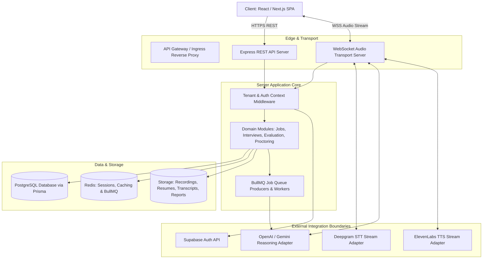
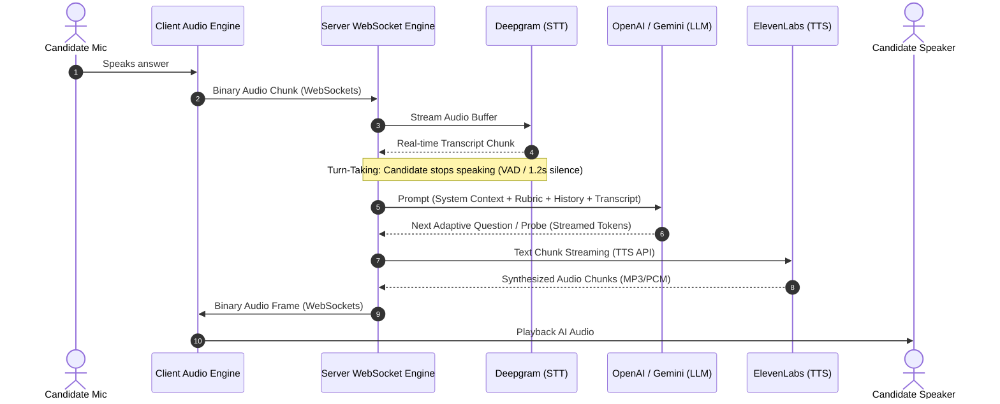
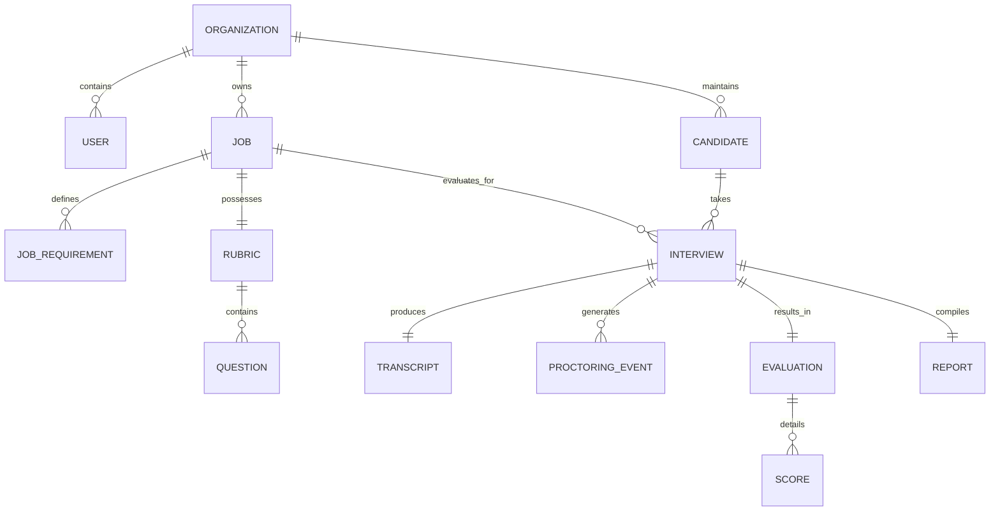

# Technical & System Architecture Document — QualifyAI

**Document Status:** Approved / Source of Truth  
**Target Platform:** QualifyAI Enterprise SaaS  
**Document Version:** 1.0.0  

---

## 1. Executive Architectural Summary

QualifyAI is an enterprise-grade, multi-tenant SaaS platform architected as a **Modular Monolith** with clean domain boundaries, high-performance real-time audio transport, and isolated external AI integration adapters.

The platform coordinates asynchronous background computation (document parsing, rubric generation, post-interview deep evaluation, PDF synthesis) with synchronous low-latency bidirectional real-time audio pipelines for conversational AI voice interviews.



---

## 2. Client Architecture (`client/`)

The client is organized around domain-oriented feature separation, reusable UI primitives, and dedicated real-time audio streaming hooks.

```
client/
├── public/                 # Static assets, favicon, manifest
└── src/
    ├── assets/             # Branding icons, illustrations, sound indicators
    ├── components/         # Reusable UI component library (design system primitives)
    ├── layouts/            # Page layouts: RecruiterLayout, CandidateLayout, PublicLayout
    ├── pages/              # Domain views: Dashboard, JobDetail, InterviewRoom, CandidateReport
    ├── routes/             # App routing, protected routes, tenant & role guards
    ├── services/           # Axios/Fetch API client wrappers for REST endpoints
    ├── hooks/              # Custom hooks: useAudioStream, useInterviewSocket, useAuth
    ├── context/            # Global state: AuthContext, OrganizationContext, AudioDeviceContext
    ├── lib/                # Client third-party library configurations
    ├── constants/          # UI constants, route paths, error codes
    ├── utils/              # Pure formatting, time, and audio math helpers
    └── styles/             # Global CSS, design tokens, Tailwind configuration
```

### 2.1 Key Client Subsystems
1. **Audio Streaming Engine (`useAudioStream.js`)**:
   - Manages `navigator.mediaDevices.getUserMedia` with strict audio constraints (echo cancellation, noise suppression, auto-gain control).
   - Utilizes `AudioWorklet` or `MediaRecorder` for chunking raw PCM/WebM Opus audio.
   - Computes real-time input audio energy levels for visual waveform feedback.
2. **WebSocket Interview Manager (`useInterviewSocket.js`)**:
   - Manages duplex WebSocket connection to the server.
   - Emits candidate audio buffers and UI status telemetry (e.g., tab focus change).
   - Receives server-synthesized audio chunks and streams them smoothly into an `AudioContext` buffer queue.
3. **Recruiter Workspace & Analytics**:
   - Data-dense candidate pipeline tables with multi-parameter filtering.
   - Interactive radar charts comparing candidate competencies against the job rubric.
   - Synchronized audio-transcript playback scrubber.

---

## 3. Server Architecture (`server/`)

The server follows a **Layered Clean Architecture** where requests flow systematically through distinct, single-responsibility layers:

```
Request
   ↓
[Routing Layer]        (server/src/routes/)         - Defines endpoints & HTTP methods
   ↓
[Middleware Layer]     (server/src/middleware/)     - Auth verification, tenant scoping, validation
   ↓
[Controller Layer]     (server/src/controllers/)    - Request unwrapping, HTTP response formatting
   ↓
[Service Layer]        (server/src/services/)       - Pure business logic & transaction handling
   ↓
[Domain Modules]       (server/src/modules/)        - Feature aggregations & cross-service orchestration
   ↓
[Integrations Layer]   (server/src/integrations/)   - Encapsulated external SDK calls (Deepgram, OpenAI, etc.)
   ↓
[Persistence Layer]    (PostgreSQL via Prisma ORM)  - Tenant-scoped data access
```

### 3.1 Server Directory Structure
```
server/src/
├── config/             # App environment variables, Redis client, Prisma client
├── constants/          # System error codes, roles, interview states, queue names
├── middleware/         # authMiddleware, tenantMiddleware, rateLimiter, errorHandler
├── routes/             # authRoutes, jobRoutes, candidateRoutes, interviewRoutes, reportRoutes
├── controllers/        # authController, jobController, interviewController, reportController
├── services/           # jdParserService, rubricService, interviewService, evaluationService
├── validators/         # Joi/Zod request schemas for strict payload validation
├── integrations/       # Isolated third-party adapters (Deepgram, OpenAI, ElevenLabs, Supabase)
├── modules/            # Domain module configurations and event bindings
└── utils/              # Structured logger (Winston/Pino), audio helpers, token utilities
```

---

## 4. Real-Time AI Voice Pipeline Architecture

The real-time conversational interview engine is a critical low-latency pipeline connecting candidate voice input to speech synthesis through conversational intelligence.



### 4.1 Latency Optimization Strategy
- **Concurrent Streaming**: Do not wait for complete LLM generation before beginning TTS synthesis. Stream the first complete sentence chunk from the LLM directly into the ElevenLabs streaming socket.
- **Audio Worklet Delivery**: Candidate audio is captured at 16kHz/24kHz mono PCM for minimal encoding overhead.
- **Turn-Taking Detection**: Combines server-side VAD (Voice Activity Detection) with client-side speech end indicators to minimize dead air while preventing accidental interruptions.

---

## 5. External Integration Boundaries

To maintain long-term maintainability and avoid vendor lock-in, **all external vendor SDKs are isolated behind interface adapters** inside `server/src/integrations/`:

| Provider | Purpose | Integration Wrapper | Interface Contract |
| :--- | :--- | :--- | :--- |
| **Deepgram** | Real-Time STT | `integrations/stt/deepgramAdapter.js` | `createSTTStream(sessionId, onTranscript, onError)` |
| **OpenAI / Gemini** | LLM Reasoning | `integrations/llm/llmAdapter.js` | `generateInterviewTurn(context, prompt, streamCallback)` |
| **ElevenLabs** | Real-Time TTS | `integrations/tts/elevenLabsAdapter.js` | `synthesizeSpeechStream(textStream, onAudioChunk)` |
| **Supabase** | Auth & Identity | `integrations/auth/supabaseAuthAdapter.js` | `verifyToken(jwt)`, `getUserProfile(userId)` |
| **Redis** | Queues & Cache | `config/redis.js` | Redis client instance for BullMQ and session state |

**Rule**: Application services (`server/src/services/`) never import `openai`, `deepgram-sdk`, or `elevenlabs-node` directly. They interact solely with the domain-specific integration interfaces.

---

## 6. Multi-Tenancy & Authorization Model

QualifyAI implements a **Shared Database, Shared Schema with Tenant Discriminator** multi-tenancy model.

### 6.1 Tenant Hierarchy
```
Organization (Tenant Root)
   ├── Users (Admins, Recruiters, Hiring Managers)
   ├── Jobs
   │     ├── Requirements
   │     ├── Rubric
   │     └── Questions
   ├── Candidates
   │     └── Interviews
   │           ├── Transcripts & Audio Recordings
   │           ├── Evaluation Scorecards
   │           ├── Proctoring Events
   │           └── Final Reports
   └── Organization Assets
```

### 6.2 Tenant Scoping Invariants
1. **Context Extraction**: The `tenantMiddleware` extracts the authenticated user's `organizationId` from the verified JWT claims.
2. **Context Binding**: The `organizationId` is stored in the request context (`req.organizationId`).
3. **Database Scoping**: Every Prisma query affecting tenant-owned models **must** include `{ where: { organizationId } }`.
4. **Candidate Access**: Candidates are granted temporary, cryptographically signed session tokens scoped exclusively to their specific `interviewId` and `candidateId`. They have zero access to organization-level endpoints.

---

## 7. Database Architecture (PostgreSQL & Prisma)

The primary database is PostgreSQL, accessed via Prisma ORM.

### 7.1 Core Entity Model Summary

- **`Organization`**: Tenant entity (name, slug, subscription status, settings).
- **`User`**: Team members belonging to an Organization (email, role: `ORG_ADMIN`, `RECRUITER`, `REVIEWER`).
- **`Job`**: A hiring requisition created by a recruiter (title, description, status, department, `organizationId`).
- **`JobRequirement`**: Structured extracted skills, seniority, and criteria parsed from the JD.
- **`Rubric`**: Evaluation matrix associated with a Job (weights, categories, level descriptors).
- **`Question`**: Seed question pool generated for the Job and Rubric.
- **`Candidate`**: Applicant profile (name, email, phone, resume URL, `organizationId`).
- **`Invitation`**: Unique tokenized invitation linking a Candidate to an Interview for a specific Job.
- **`Interview`**: An interview session instance (status: `PENDING`, `IN_PROGRESS`, `COMPLETED`, `EVALUATED`, scheduled time, start/end timestamps).
- **`InterviewTurn`**: Sequential exchange containing candidate audio timestamp, candidate transcript, and AI response.
- **`Transcript`**: Aggregated full dialogue with speaker attribution and timestamps.
- **`Evaluation`**: Multi-dimensional score breakdown generated post-interview.
- **`Score`**: Granular scores per rubric criterion with cited evidence quotes.
- **`ProctoringEvent`**: Audit event (type: `TAB_HIDDEN`, `FOCUS_LOST`, `SECONDARY_AUDIO_DETECTED`, timestamp, duration).
- **`Report`**: Comprehensive candidate report summary, diagnostic feedback, and generated PDF link.



---

## 8. Logical Storage Architecture (`storage/`)

QualifyAI manages sensitive digital artifacts organized into logical storage categories with tenant path prefixing:

```
storage/
├── resumes/                 # {orgId}/{candidateId}/resume.pdf
├── job-descriptions/        # {orgId}/{jobId}/jd_original.pdf
├── interview-recordings/    # {orgId}/{interviewId}/audio_full.webm
├── transcripts/             # {orgId}/{interviewId}/transcript.json
├── reports/                 # {orgId}/{interviewId}/candidate_report.pdf
├── candidate-documents/     # {orgId}/{candidateId}/supporting_docs/
├── organization-assets/     # {orgId}/branding/logo.png
└── temp/                    # Ephemeral files for audio transcoding / PDF generation
```

### 8.1 Storage Security Rules
- Files are accessed only via **time-limited Signed URLs** generated by the server.
- The `storage/` directory is logically separated from the application codebase. In local development, it operates on a secure filesystem sandbox; in production, it maps to Supabase Storage or S3-compatible buckets.

---

## 9. Asynchronous Processing & Job Queues (BullMQ / Redis)

Long-running operations are offloaded from HTTP request loops to BullMQ workers:

1. **`queue:jd-parsing`**: Handles document text extraction and LLM-based competency/rubric generation.
2. **`queue:post-interview-evaluation`**: Triggered when an interview completes; orchestrates deep LLM analysis against all transcript turns and rubric benchmarks.
3. **`queue:report-pdf-generation`**: Compiles evaluation data into a branded, printable PDF candidate dossier.
4. **`queue:email-notifications`**: Dispatches candidate invitations, reminder alerts, and recruiter completion digests.

---

## 10. Proctoring & Integrity Architecture

QualifyAI provides an objective interview integrity framework focused on environment and acoustic validity:

- **Browser State Monitor**: Client tracks `document.visibilitychange` and `window.blur` events and dispatches signed events to the server.
- **Acoustic Signal Processing**: Evaluates audio streams for multi-speaker presence, abrupt microphone disconnects, or anomalous acoustic patterns.
- **Audit Log**: All integrity events are stored in `ProctoringEvent` records with precise timestamps linked to the interview transcript.
- **Explicit Invariant**: Facial recognition, eye-gaze tracking, and micro-expression emotion detection are strictly excluded from the architecture.

---

## 11. Architectural Decision Records (ADR Summary)

- **ADR-001: Modular Monolith Repository Pattern**: Selected over premature microservices to maximize development velocity and simplify transactions while preserving clean domain encapsulation.
- **ADR-002: Adapter-Based AI Provider Isolation**: AI vendors (Deepgram, OpenAI, ElevenLabs) are decoupled behind interfaces to guarantee provider agility.
- **ADR-003: WebSocket Audio Transport with Server Orchestration**: Chosen over client-side direct peer-to-peer to maintain strict server-side audit logs, real-time recording, and authoritative session state.
- **ADR-004: Exclusion of Facial Biometrics**: Banned emotion/facial expression scoring to ensure legal compliance, ethical recruitment practices, and elimination of algorithmic bias.
