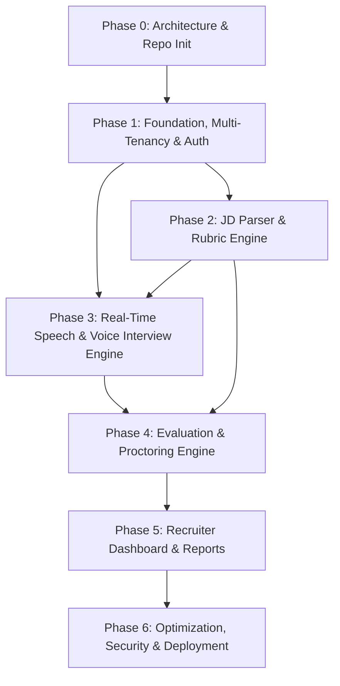

# Project Development Roadmap & Phases — QualifyAI

**Document Status:** Approved / Source of Truth  
**Target Platform:** QualifyAI Enterprise SaaS  
**Document Version:** 1.0.0  

---

## 1. Roadmap Overview & Execution Philosophy

QualifyAI is built systematically through six defined phases. Each phase establishes a stable layer upon which subsequent real-time and AI systems depend.

```
Phase 0: Architecture & Repository Initialization (COMPLETED)
   ↓
Phase 1: Foundation, Multi-Tenancy & Authentication
   ↓
Phase 2: Job Description Parsing & Dynamic Rubric Engine
   ↓
Phase 3: Real-Time Speech Pipeline & AI Voice Interview Engine
   ↓
Phase 4: Multi-Dimensional Evaluation & Proctoring/Integrity Engine
   ↓
Phase 5: Recruiter Dashboard, Candidate Reports & Analytics
   ↓
Phase 6: Performance Optimization, Security Hardening & Deployment
```

---

## 2. Phase Breakdown & Milestones

### Phase 0: Architecture & Repository Initialization
- **Status:** **COMPLETED**
- **Objective:** Establish the clean monorepo architecture, create seven source-of-truth Markdown documents, set up directory structures across `client/`, `server/`, `storage/`, `document/`, and `docs/`, and define engineering rules without generating premature implementation code.
- **Deliverables:**
  - Seven root Markdown source-of-truth documents.
  - Complete directory tree for client, server, storage, document, and docs.
  - Initialized project memory and baseline rules.
- **Exit Criteria:** All mandatory files and directories exist; no reference project code exists; validation passes.

---

### Phase 1: Foundation, Multi-Tenancy & Authentication
- **Status:** **PLANNED (NEXT)**
- **Objective:** Establish backend and frontend project foundations, database schema, multi-tenant isolation, and user authentication.
- **Key Milestones:**
  - **M1.1: Project Tooling & Workspace Setup**: Root package scripts, linting/formatting, and environment variable validation.
  - **M1.2: Database & Prisma Modeling**: PostgreSQL connection with Prisma ORM; core models (`Organization`, `User`, `Job`, `Candidate`, `Interview`, `Transcript`, `Evaluation`, `Report`).
  - **M1.3: Authentication & Tenant Middleware**: Supabase Auth integration, JWT verification, RBAC (`ORG_ADMIN`, `RECRUITER`, `REVIEWER`, `CANDIDATE`), and request tenant binding.
  - **M1.4: Base Client Application**: React / Next.js setup with Tailwind CSS design tokens, layouts (`RecruiterLayout`, `CandidateLayout`, `PublicLayout`), and authentication session context.
- **Exit Criteria:**
  - Secure signup/login for recruiters with organization auto-provisioning.
  - Tenant context strictly enforced on all authenticated routes.
  - Automated integration tests verifying cross-tenant isolation.

---

### Phase 2: Job Description Parsing & Dynamic Rubric Engine
- **Status:** **PLANNED**
- **Objective:** Enable recruiters to upload JDs and automatically generate validated, role-specific rubrics and question pools.
- **Key Milestones:**
  - **M2.1: JD File Upload & Text Extraction**: Multi-format document parser (PDF, DOCX, text) with storage integration.
  - **M2.2: LLM Extraction Pipeline**: Extraction of technical competencies, framework dependencies, system design requirements, and seniority tiers using structured JSON schemas.
  - **M2.3: Dynamic Rubric Generator**: Synthesis of multi-dimensional evaluation criteria with 1–5 scoring benchmarks.
  - **M2.4: Question Pool Generation**: Generation of seed technical questions targeting specific rubric dimensions.
  - **M2.5: Recruiter Review & Customization UI**: Interactive interface allowing recruiters to adjust criteria weights, add custom questions, and finalize job setup.
- **Exit Criteria:**
  - Uploading a JD produces a structured, editable rubric and question pool in under 15 seconds.
  - Recruiter can customize and persist finalized rubrics to PostgreSQL.

---

### Phase 3: Real-Time Speech Pipeline & AI Voice Interview Engine
- **Status:** **PLANNED**
- **Objective:** Construct the bidirectional low-latency audio transport and conversational AI interviewer.
- **Key Milestones:**
  - **M3.1: Candidate Interview Link & Hardware Check**: Tokenized interview onboarding page with interactive mic/speaker check and connectivity test.
  - **M3.2: WebSocket Audio Transport**: Bidirectional binary audio streaming over WebSockets between client and server.
  - **M3.3: Deepgram Live STT Integration**: Streaming candidate audio directly to Deepgram with real-time transcript chunk emission and VAD.
  - **M3.4: Conversational LLM Orchestrator**: Turn-taking logic with OpenAI/Gemini; rubric-grounded adaptive follow-up probing and dynamic question progression.
  - **M3.5: ElevenLabs Live TTS Integration**: Streaming AI responses through ElevenLabs TTS back to the client for immediate playback.
  - **M3.6: Candidate Interview Room UI**: Ambient animated visualizer orb, state indicators (`AI Speaking`, `Listening`, `Thinking`), and emergency reconnection handling.
- **Exit Criteria:**
  - Full end-to-end voice dialogue functional with conversational turnaround latency targeting < 1200ms.
  - Session state persists cleanly through network dropouts up to 5 minutes.

---

### Phase 4: Multi-Dimensional Evaluation & Proctoring Engine
- **Status:** **PLANNED**
- **Objective:** Process complete interview transcripts to generate auditable scores and integrity analytics.
- **Key Milestones:**
  - **M4.1: Post-Interview Asynchronous Worker**: BullMQ job triggered on interview completion to run multi-dimensional evaluation.
  - **M4.2: Rubric-Grounded Scoring Service**: Detailed evaluation across Technical Correctness, Depth, Problem Solving, and Communication Clarity, with cited transcript quotes.
  - **M4.3: Proctoring & Integrity Signal Analyzer**: Collation of tab-switching events, window blur occurrences, and audio acoustic anomalies.
  - **M4.4: Diagnostic Feedback Generator**: Synthesis of candidate growth feedback highlighting strengths and specific improvement areas.
- **Exit Criteria:**
  - Comprehensive score breakdown generated with 100% transcript-grounded citations.
  - Proctoring event timeline generated without any facial/micro-expression scoring.

---

### Phase 5: Recruiter Dashboard, Candidate Reports & Analytics
- **Status:** **PLANNED**
- **Objective:** Deliver recruiter analytical tools, candidate comparison leaderboards, and downloadable executive PDF dossiers.
- **Key Milestones:**
  - **M5.1: Recruiter Candidate Pipeline & Ranking**: Data table with multi-attribute sorting (Composite score, technical depth, communication, status).
  - **M5.2: Detailed Candidate Scorecard View**: Interactive radar charts, dimension breakdowns, audio playback synchronized with transcript text, and proctoring logs.
  - **M5.3: PDF Report Generation Service**: Headless PDF synthesis generating branded, downloadable candidate reports.
  - **M5.4: Candidate Diagnostic Feedback View**: Dedicated candidate-facing portal for reviewing constructive feedback (if permitted by recruiter).
- **Exit Criteria:**
  - Recruiters can inspect, compare, and export candidate dossiers in under 3 clicks.
  - PDF generation executes asynchronously in < 10 seconds via BullMQ.

---

### Phase 6: Optimization, Security Hardening & Production Launch
- **Status:** **PLANNED**
- **Objective:** Harden security, optimize real-time latency, ensure regulatory compliance, and deploy to production infrastructure.
- **Key Milestones:**
  - **M6.1: Security Audit & Penetration Hardening**: Rate limiting, strict payload sanitization, Supabase RLS verification, signed storage URL enforcement.
  - **M6.2: Audio Pipeline Latency Tuning**: Audio chunk buffering optimization, pre-warmed TTS connections, and token stream pipelining.
  - **M6.3: Load Testing & Scalability**: Stress testing concurrent WebSocket interview sessions and Redis BullMQ throughput.
  - **M6.4: CI/CD & Deployment**: Production Docker containers, staging environment deployment, automated testing pipeline.
- **Exit Criteria:**
  - End-to-end audio turnaround reliably under 1200ms at 95th percentile.
  - Clean security audit with zero critical vulnerabilities.
  - Production readiness sign-off.

---

## 3. Dependency Graph Between Phases


